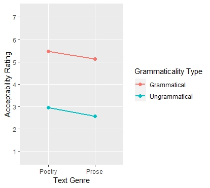

# Background
This study formed the research project and dissertation aspect of my Masters course. The project ran from September 2018 to August 2019 and was titled "Investigating the Role of Genre in Language Processing and Comprehension". 
In language research it is widely observed that incorrect grammar requires more processing (reflected in increased reading times) and poorer comprehension. However, there is evidence from different languages of genre (a chosen linguistic style of text) influencing this grammaticality effect. This study aimed to replicate the findings of German pilot data which found ungrammatical sentences to be processed more easily and understood better when embedded in poetry compared to prose.

# Online Sentence Acceptability Survey
40 short sentences were created for the stimuli, with 4 versions of each: grammatical poem, ungrammatical poem, grammatical prose and ungrammatical prose. The first aspect of the study was to run a small, online pilot survey to collect overt ratings from native English speakers on the 'acceptability' of the sentences. Genre was between-subjects so participants either saw poetry or prose sentences but grammaticality was within-subjects with half of each list of sentences was grammatical and the other half ungrammatical. Participants would read each of the 40 sentences and provide a rating from 1 (not acceptable at all) to 7 (perfectly acceptable). 81 participants took part in the online survey.

##    The Data
The aim of this part of the study was to identify if genre or grammaticality, or both, had a significant effect on the acceptability ratings of the sentences. As per the University of Glasgow's policy on data collection and storage, I am not authorised to provide the data set I collected but will show an example of the form it took in order to help illustrate the data manipulation process.

When the data was downloaded from the Jisc survey platform, there were four lists which looked like this:


This is not ideal for analysis so some data manipulation was required in order for the data to be 'tidy'. Initially, I put the data in long form so that every observation had its own row. I did this individually for each of the 4 lists and I will show this process for list 1. List 1 consisted of all poetry sentences, with sentences 1-20 grammatically correct and sentences 21-40 grammatically incorrect. 

```{r, eval=FALSE}
library(tidyverse) #Load in required package. This includes the 'dplyr' package that I will use a lot to manipulate the data.

list1 <- read.csv("list1.csv") %>% #Load in data
  gather("sentence", "rating", -1) %>% #Gather the data into long form, apart from ID number
  mutate(sentence = gsub("Q", "", sentence)) #This removes the Q from the start of each sentence number
list1$sentence <- as.numeric(list1$sentence) #Tell R to treat sentence number as a numeric value 
list1 <- list1 %>% 
  mutate(genre = "poetry", #Add a genre variable and assign all List 1 observations "poetry"
         type = ifelse(sentence <=20, "grammatical", "ungrammatical")) %>%  #Add a type variable and sentences numbers 1-20 are assigned "grammatical", sentences 21-40 are assigned "ungrammatical".
  select(Unique.Response.Number, sentence, genre, type, rating) #Reorder the columns so that rating is last.
```


All 4 lists were altered in this way. In order to be used in analysis, all lists were joined and the two predictor variables ('genre' and grammaticality aka 'type') were mean-centre predictor coded. This means that, for two variables, one is assigned the value 0.5 and the other -0.5 but if there were more participants in one of the groups then these values will be slightly off 0.5. 

```{r, eval=FALSE}

all_data <- bind_rows(list1, list2, list3, list4) #Stacks all four lists on top of each other.

all_data$genre_code <- scale(ifelse(all_data$genre == "poetry", 0, 1), scale = FALSE) #Mean centre predictor coding the genre variable. 
all_data$type_code <- scale(ifelse(all_data$type == "grammatical", 0, 1), scale = FALSE) #Same process for the type variable.
all_data$rating <- factor(all_data$rating) #The response variable needs to be a factor.
colnames(all_data)[colnames(all_data)=="Unique.Response.Number"] <- "id" #Rename the participant column 'id' for simplicity.

```

After this, the data is ready for statistical analysis. The final data looks like this:


##    Analysis
Prior to conducting inferential analyses, an interaction plot was consulted. This plot shows the average acceptability rating of sentences for each combination of variables. 



Judging from the plot, there is no interaction between genre type and grammaticality type. There is a clear difference in the acceptability ratings of grammatical and ungrammatical sentences with the latter condition resulting in much lower acceptability ratings, regardless of text genre. Prose sentences were rated very slightly lower than poetry sentences in both grammatical and ungrammatical conditions.

In order to test this inferentially, 


The aim of data analysis was to identify if either of the two predictor variables genre (poetry or prose) or grammaticality type (grammatical or ungrammatical) had a significant effect on the response variable (sentence acceptability rating).

```{r, eval=FALSE}
reg_default <- clmm(rating ~ genre_code * type_code +  
              (1 + type_code | id) +  
              (1 + type_code*genre_code| sentence),
            data = all_data)
```


