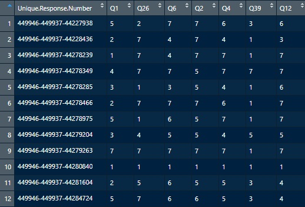
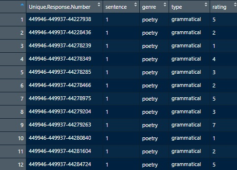
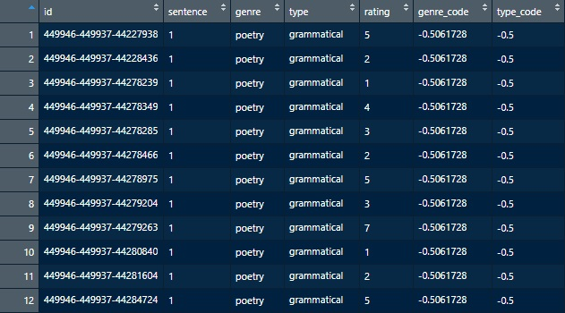
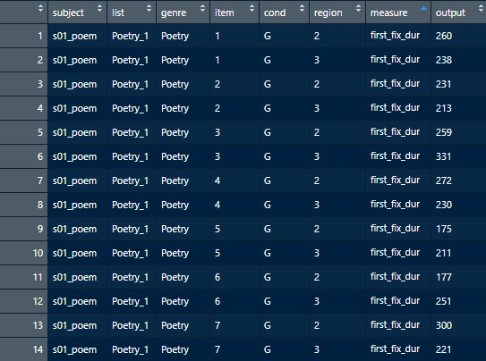
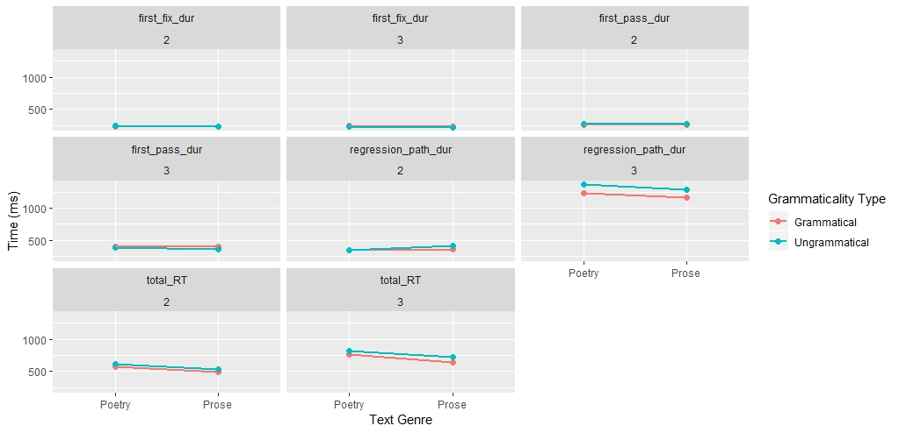
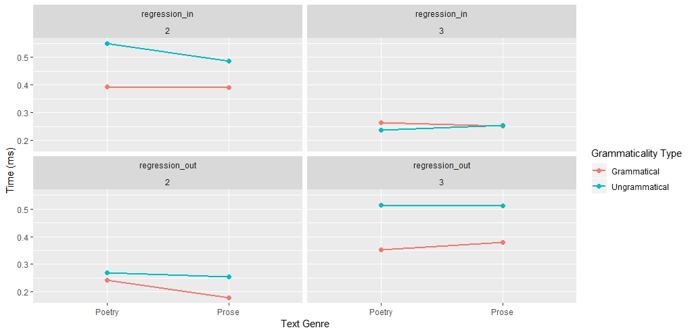
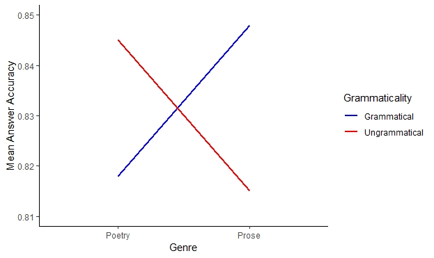

# Background
This study formed the dissertation aspect of my Masters course. The project ran from September 2018 to August 2019 and was titled "Investigating the Role of Genre in Language Processing and Comprehension".

In language research, it is widely observed that reading text with incorrect grammar requires more processing than correct grammar (reflected in increased reading times) and results in poorer comprehension. However, there is evidence from different languages that genre (a chosen linguistic style of text e.g. poetry) can influence this grammaticality effect. This study aimed to replicate the findings of German pilot data which found ungrammatical sentences to be processed more easily and understood better when embedded in poetry compared to prose. 

The study consisted of two separate experiments. The first was an online survey which aimed to discover if genre influenced overt ratings of sentence 'acceptability' and the second experiment was made up of an eye tracking task and follow-up comprehension questions. In the sections below, you can find the code used for data manipulation, analysis and visualisation for each component of the study as well as brief summaries of the findings.

# Online Sentence Acceptability Survey
The first experiment of the study was an online survey which collected overt ratings from native English speakers on the 'acceptability' of forty short sentences (these were subsequently used in the second experiment as well). The aim of this part of the study was to identify if genre or grammaticality, or both, had a significant effect on the acceptability ratings of the sentences. 

The forty sentences, which were used as the stimuli, existed in each of four forms: grammatical poem, ungrammatical poem, grammatical prose and ungrammatical prose. Four lists of sentences were made using a latin square such that each sentence appeared in each of its four forms. Genre was between-subjects so participants either saw poetry or prose sentences but grammaticality was within-subjects with half of each list of sentences being grammatical and the other half ungrammatical. Participants would read each of the forty sentences and provide a rating from 1 (not acceptable at all) to 7 (perfectly acceptable). Eighty-one participants took part in the online survey.

##    The Data
As per the University of Glasgow's policy on data collection and storage, I am not authorised to provide the actual data set itself but can show an example of the form it took in order to help illustrate the data manipulation process.

When the data was downloaded from the online survey platform, there were four lists which looked like this:



The data being in this form was not ideal for the analysis that would be carried out so some manipulation was required in order to 'tidy' the data set. Initially, I put the data in long form so that every row was an observation. I did this individually for each of the 4 lists and I will show this process performed on list 1. List 1 consisted of all poetry sentences, with sentences 1-20 grammatically correct and sentences 21-40 grammatically incorrect. 

```{r, eval=FALSE}
library(tidyverse) #Load in required package. This includes the 'dplyr' package that I will use a lot to manipulate the data.

list1 <- read.csv("list1.csv") %>% #Create a new variable and load in the data
  gather("sentence", "rating", -1) %>% #Gather the data into long form, apart from ID number
  mutate(sentence = gsub("Q", "", sentence)) #Remove the 'Q' character from the start of each sentence number

list1$sentence <- as.numeric(list1$sentence) #Change sentence number to data type numeric (required for next step)

list1 <- list1 %>% 
  mutate(genre = "poetry", #Add a new column for the genre variable and assign all List 1 observations "poetry"
         type = ifelse(sentence <=20, "grammatical", "ungrammatical")) %>%  #Add a column for the sentence type variable and sentences numbers 1-20 are assigned "grammatical", sentences 21-40 are assigned "ungrammatical".
  select(Unique.Response.Number, sentence, genre, type, rating) #Reorder the columns so that rating appears last (outcome variable after predictor variables)
```

This is how the data appears after running the code above.



This process was repeated for each of the 4 lists with the genre and grammaticality coding changing where appropriate. Following this, all lists were joined in order to be used in analysis. The two predictor variables ('genre' and grammaticality (called 'type' in the script)) were mean-center predictor coded. This allows you to assign arbitrary numerical values to categorical variables. When you have two levels, one is assigned the value 0.5 and the other -0.5 but this number can change slightly if the samples used in each group are unbalanced.

```{r, eval=FALSE}

all_data <- bind_rows(list1, list2, list3, list4) #Create a new variable that consists of all four lists stacked on top of each other.

all_data$genre_code <- scale(ifelse(all_data$genre == "poetry", 0, 1), scale = FALSE) #Add a new column showing the mean center predictor coding for the genre variable. 
all_data$type_code <- scale(ifelse(all_data$type == "grammatical", 0, 1), scale = FALSE) #Same process for the grammaticality ('type') variable.
all_data$rating <- factor(all_data$rating) #Change the data in the rating column into data type 'factor' (required for analysis)
colnames(all_data)[colnames(all_data)=="Unique.Response.Number"] <- "id" #Rename the participant ID column 'id' for simplicity in the model.

```

After this, the data is ready for statistical analysis. The final data looks like this:



##    Analysis
The aim of data analysis was to identify if either of the two predictor variables (genre or grammaticality) had a significant effect on the response variable (sentence acceptability rating), or indeed if there was an interaction between the two. The hypothesis was that an interaction would exist such that ungrammatical poems would be rating as more acceptable than ungrammatical prose.

Prior to conducting inferential analyses, I created an interaction plot using the following code:
```{r, eval = FALSE}
library(ggplot2) #Load in the required package for creating plots.

ggplot(all_data, aes(x = genre, colour = type, group = type, y = rating)) + #x-axis is genre, y-axis is the average rating and the plot is grouped and colour-coded by grammaticality type 
  stat_summary(fun.y = mean, geom = "point", size = 2) + #specify how you want the data points to appear
  stat_summary(fun.y = mean, geom = "line", size = 1) +
  ylab("Acceptability Rating") + #label the axes
  xlab("Text Genre") +
  scale_x_discrete(labels = c("Poetry", "Prose")) + #label the two levels of the x axis variable
  labs(colour = "Grammaticality Type") + #label the legend box
  scale_colour_discrete(labels = c("Grammatical", "Ungrammatical")) #label the two levels of the legend box
```


This plot shows the mean acceptability rating of sentences for each combination of variables. 


Responses were discrete but rank-ordered so an ordinal logistic model was best suited for inferential analysis. The analysis used the maximal random effects structure justified by the design including random correlations. In the model, you only include the within-subjects variables when defining the random intercepts and this is done separately for subjects (in our data this is "id") and items (in our data this is "sentence"). 

```{r, eval=FALSE}
library(ordinal) #Load in required packages
library(psych)

reg_default <- clmm(rating ~ genre_code * type_code +  #outcome variable ~ predictor variables
              (1 + type_code | id) +  #Only type is within-subjects for subjects.
              (1 + type_code*genre_code| sentence), #Both type and genre within-subjects for items.
            data = all_data) #Specifying the data set on which to run the model.

summary(reg_default) #This gives a summary of the results of the model.
```

## Results
Consistent with the descriptive statistics, inferential analysis results showed no significant interaction and no significant main effect of genre. However, a main effect of grammaticality was found such that, independent of genre, ungrammatical sentences were rated as significantly less acceptable than those in the grammatical condition.

The main effect of grammaticality was expected given that native English speakers would be likely to innately find ungrammatical sentences less acceptable than grammatical ones. However, the lack of an interaction was an indication that genre type was not sufficient in overcoming this grammaticality effect.

# Eye Tracking and Comprehension Experiment  
The second stage of the project was an eye tracking experiment carried out in the psychology department of the University of Glasgow. In the online survey we were testing participants' overt ratings of the stimuli but in the eye tracking experiment we were aiming to measure the unconscious effect of genre and grammaticality. Specifically, we were investigating how the predictor variables influenced reading time of text through various eye tracking measures and comprehension success of the sentences (measured through post-trial comprehension questions). 

The stimuli used was the same as in the online survey with the addition of thirty filler sentences and post-trial questions for all of the original forty sentences. These were simple yes/no comprehension questions to test whether the participant had understood the roles of the subject and object in the sentence. Each question had a form for which the correct answer was "yes" and one for which the correct answer was "no". Eight stimuli lists were created using a latin square so that each sentence appeared in each of its four forms and followed by each question type i.e. grammatical/ungrammatical poetry/prose sentences with follow-up questions type "yes"/type "no".

During the experiment, participants' eye movements were tracked using a desktop-mounted Eyelink 1000/2k. Each sentence was presented individually on a computer screen and participants were required to indicate with a button press when they had read it. This button press prompted either the appearance of the corresponding comprehension question or the next sentence (if the sentence they had just read was a filler). The question was answered by pressing a key on the keyboard in front of them ('m' = "yes" and 'z' = "no"). This process was repeated until they had read all seventy sentences. Forty people took part in the eye tracking experiment, this corresponded to five participants for each of the eight stimuli lists.

I will describe the data manipulation process and analysis for the eye tracking and comprehension data separately.  

## Eye Tracking Data
For the purposes of the eye tracking measures, the sentences were divided into four regions of interest:
e.g.      /R1/ Peter sets the hardest tests and Martin /R2/ knows /R3/ the students /R4/ best.
This was the same approach used for all sentences such that, in the second clause, the verb was represented by region 2 and the post-verb by region 3. These were the two critical regions used in analysis as they represent the earliest (R2) and second earliest (R3) point in the sentence at which a grammatical violation could be detected. 

Six distinct eye tracking measures were used in the experiment. First fixation duration (FFD) is the length of time of the initial fixation on a region. First Pass Reading Time (FPRT) is the sum of fixations within a region from the initial fixation until the region is exited in either direction. Regression Path Duration (RPD) is the sum of fixations within a region from the initial fixation until the region is exited to the right. Total Reading Time (TRT) is the sum of all fixations on a region. Regression in (PRI) and regression out (PRO) are the occurrence of at least one regression into or out of a particular region, respectively.

The eye tracking system allows users to specify the form of the output data. This was set up prior to data collection and so didn't require a great deal of manipulation prior to analysis, it was in the following form:

![Each row shows the various output measures gathered from reading one sentence. The columns show the subject ID, the list number that the participant read sentences from, the genre of the sentence, the sentence number (item), the grammaticality of the sentence (cond), the region of interest (2 or 3) and then output data for the following measures: FFD, FPD, RPD, TRT, PRI and PRO. The example below shows the data for the first partiicpant reading the first 7 sentences of the list. Each sentence is split across two rows as the output measures were collected separately for regions 2 and 3.](original_eye_data.jpg)

The first manipulation that was required was to specify which data points to include in analysis, these decisions were based on standard approaches used in the research area e.g. fixations under 80ms are not typically included. Initially, histograms of each of the four numerical measures (FFD, FPD, RPD and TRT) were consulted and cut-offs were then applied based on outliers. No such outlier manipulation was required for the regression in/out data. The following shows the process for the first fixation duration data:

```{r, eval=FALSE}
hist(eyedata$first_fix_dur, breaks = 100) #Fit a histogram of first fixation duration data

val.FFD.dat <- subset(eyedata, eyedata$first_fix_dur > 80 & eyedata$first_fix_dur < 600) #Subset eye data to only include first fixation duration data from 80ms to 600ms
```

Furthermore, a new variable was created for each measure to separate the regions of interest. Again, showing first fixation duration as an example:

```{r, eval=FALSE}
R2.FFD.dat <- subset(val.FFD.dat, val.FFD.dat$region == 2) #Create a FFD variable for Region 2 analysis.
R3.FFD.dat <- subset(val.FFD.dat, val.FFD.dat$region == 3) #Same for region 3
```

Finally, just like for the survey data analysis, the two predictor variables ('genre' and 'grammaticality') were mean-center predictor coded to apply an arbitrary numerical value to categorical predictors. FFD example:

```{r, eval=FALSE}
R2.FFD.dat$genre_c <- scale(ifelse(R2.FFD.dat$genre == "Prose",0,1), scale = FALSE)
R2.FFD.dat$gramm_c <- scale(ifelse(R2.FFD.dat$cond == "U",0,1), scale = FALSE)
```


## Analysis
The aim of data analysis was to identify if either of the two predictor variables genre (poetry or prose) or grammaticality type (grammatical or ungrammatical) had a significant effect on the various response variables, or if there was an interaction between the two. The hypothesis was that there would be an interaction such that ungrammatical poetry would be processed more easily (quicker reading times) than ungrammatical prose.

Prior to conducting inferential analyses, an interaction plot for both regions of interest for each measure was consulted. In order to make the plot, data manipulation was required to get it into a form in which every row was a single observation. In order to do this, I wanted to keep the first 6 columns of the eye data the same but then instead of a separate column for each measure, I would gather the measures and outputs into 2 distinct columns. I did this separately for the continuous reading time measures (FFD, FPD, RPD and TRT) and then the binary measures (RI and RO).

```{r, eval=FALSE}
numerical_gather_eyedata <- eyedata %>% #Create a new variable
  select(1:10) %>% #Select everything from the eye data apart from the regression in and out columns (i.e. all continuous data).
  gather("measure", "output", 7:10) #Take all of the separate measure columns and output and put them into 2 new columns of measure and output 
```

This code changed the data to look like this:



With the data in this form, the following code was used to create a graph with an interaction plot showing the average reading time in all continuous measures for each combination of variables for both regions. 

```{r, eval=FALSE}
ggplot(numerical_gather_eyedata, aes(x = genre, colour = cond, group = cond, y = output)) + #x-axis is genre, y-axis is the output for the specific measure and group and colour-code the plot by grammaticality type
  stat_summary(fun.y = mean, geom = "point", size = 2) + #specify how you want the data points to appear
  stat_summary(fun.y = mean, geom = "line", size = 1) +
  facet_wrap(~measure + region) + #show separate plots for each measure and each region of interest
  ylab("Time (ms)") + #label the axes
  xlab("Text Genre") +
  scale_x_discrete(labels = c("Poetry", "Prose")) + #add labels to the levels of the x-axis
  labs(colour = "Grammaticality Type") + #add labels to the legend
  scale_colour_discrete(labels = c("Grammatical", "Ungrammatical")) #add labels to the levels of the legend
```



The same process was followed to get the regression in and out interaction plot.



Judging from the various plots, there doesn't appear to be any interactions between genre and grammaticality. In the reading time graphs, it appears that ungrammatical sentences typically result in longer reading times, regardless of genre. Further analysis is required to get a clearer picture of the relationship between the two predictor variables.

There were twelve different models used for the eye tracking data as there was one for both regions of interest for all six measures. A gamma regression model was used for the FFD, FPRT and RPD continuous data and a linear regression model was used for TRT, as the continuous data included zeros. For the RI and RO analysis, a binary logistic regression model was used. I will show one example of each of the three types of models employed in the data analysis.

Gamma regression model example for FFD region 2:

```{r, eval=FALSE}
library(lme4) #Load in required package
library(optimx)

mod.FF.R2 <- glmer(first_fix_dur ~ genre_c*gramm_c + #outcome variable ~ predictor variables
                     (1 + gramm_c | subject) + #Random intercept - only gramm_c is within-subjects for subjects
                     (1 + genre_c*gramm_c | item), #Random intercept - genre_c and gramm_c are within-subjects for items
                   data = R2.FFD.dat, #Specify the data set on which to run the model
                   family = Gamma(identity), #Specify gamma regression
                   control = glmerControl(optimizer = "optimx", calc.derivs = FALSE, #Specifications of how to run the model
                                          optCtrl = list(method = "L-BFGS-B", starttests = FALSE, kkt = FALSE)))
summary(mod.FF.R2) #This gives a summary of the results of the model.

```

Linear regression model example for TRT region 3:

```{r, eval=FALSE}
mod.TR.R3 <- lmer(total_RT ~ genre_c*gramm_c +
                    (1 + gramm_c | subject) +
                    (1 + genre_c*gramm_c | item),
                  data = R3.TRT.dat,
                  control = lmerControl(optimizer = "optimx", calc.derivs = FALSE,
                                        optCtrl = list(method = "L-BFGS-B", starttests = FALSE, kkt = FALSE)))
summary(mod.TR.R3)
```

Binary logistic regression model example for RI region 2:

```{r, eval=FALSE}
mod.RI.R2 <- glmer(regression_in ~ genre_c*gramm_c +
                     (1 + gramm_c | subject) +
                     (1 + genre_c*gramm_c | item),
                   data = eyedata.R2,
                   family = binomial(logit), #Specify binary logistic regression
                   control = glmerControl(optimizer = "optimx", calc.derivs = FALSE,
                                          optCtrl = list(method = "L-BFGS-B", starttests = FALSE, kkt = FALSE)))
summary(mod.RI.R2)
```


## Results
The significant results can be seen below:

![All significant main effects found were for the grammaticality variable with no interactions or main effect of genre found across all measures in either region of interest. A positive estimate indicates that ungrammatical text was read more quickly than grammatical and vice versa for a negative estimate. There are some interesting patterns within the data in terms of main effects but there is no support within the data for the hypothesis that an interaction between genre and grammaticality exists.](eye_results.jpg)


# Comprehension Questions 
For the post-trial comprehension questions, question type was within-subjects so that half of the questions each participant saw had the correct answer "yes" and the other half "no". Participants indicated their answer by pressing a particular key on the keyboard ('m' = "yes" and 'z' = "no"). The questions related to the particular sentence they had just read and looked to measure each participant's level of understanding of the semantic roles within the sentence.

##Data
For the comprehension data, there was an issue with transferring the output from the old MS-DOS computer that the eye tracking system was on to the modern computer that the analysis was carried out with. The error meant that the answer accuracy was coded incorrectly for about 30% of the data. This meant some data manipulation was required prior to any further analysis. 

In the following code, I create a new column which translates the button press from each trial into the answer it indicates ('m' = yes and 'z' = no). I then create another column which translates the question type for each trial into what the correct answer is (question type 'byA' = correct answer "yes" and 'byB' = "no"). Finally, I create a third column which compares the button press data and the correct answer data (which are now both in the same terms) and if, for each row, the values match then it was answered correctly and is assigned a 1 and if they don't match it was answered incorrectly and assigned a 0.

```{r, eval=FALSE}
comp_data <- select(qdata, subject, list, genre, item, cond, qtype, response) #Create a new dataframe by selecting out the columns from the question answering data that I need.

comp_data$par_answer <- gsub(" ", "", comp_data$response) #This creates a new 'participant answer' column that is the same as the response column but removes the space in the character string as the following lines of code don't run properly with spaces
comp_data$par_answer <- gsub("ANSWERm", "yes", comp_data$par_answer) #For the newly created column, change "ANSWERm" to "yes"
comp_data$par_answer <- gsub("ANSWERz", "no", comp_data$par_answer) #For newly created column, change "ANSWERz" to "no"

comp_data <- comp_data[-7] #Remove the repsonse column as it is not needed anymore

comp_data <- mutate(comp_data, cor_answer = case_when(qtype == "byA" ~ "yes",
                                                      qtype == "byB" ~ "no")) #Create a new 'correct answer' column that looks at each cell in the 'question type' column and if it has "byA" then the corresponding cell in the new column for that row is "yes" and if it is "byB" then the corresponding cell in the new column for that row is "corranswer=no".

comp_data <- mutate(comp_data, 
                    accuracy = ifelse((par_answer == "yes" & cor_answer == "yes") |
                                           (par_answer == "no" & cor_answer == "no"), 1, 0)) #Create a new 'accuracy' column that compares the data in the cor_answer and par_answer columns, if they match accuracy = 1 and if not accuracy = 0. E.g. if it is question type A (correct answer "yes") and the participant indicated "yes" (with button press 'm') then they will be assigned a 1 in the accuracy column but if it was question type B (correct answer "no") and the participant indicated "yes" then they will be assigned a 0.
```

The data is now in a form which is ready for further analysis.

## Analysis
Before inferential analysis I made a interaction plot of the two key variables of interest (genre and grammaticality) with mean answer accuracy as the output to see what kind of relationship, if any, existed between the two. The hypothesis was that an interaction would exist between genre and grammaticality such that ungrammatical poems would be understood better than ungrammatical prose.

```{r, eval=FALSE}
descriptives <- describeBy(comp_data$accuracy, list(comp_data$genre, comp_data$cond), mat = TRUE, digits = 3) #Produce a summary of descriptive statistics such as means, standard deviations and standard errors. I save it as data frame.

#In the following code I create a new data frame using the data from the previous line. I could use select() to simply create a new df made up of the columns I need but in this way I can give the columns the titles as I want them to appear in the subsequent interaction plot.
accuracy_means <- data.frame("Genre" = descriptives[,2], #Create a data frame with a 'Genre' column that uses a subset of the descriptives df by indexing everything in the second column
                            "Grammaticality" = rep(c("Grammatical", "Ungrammatical"), each = 2 ), #Create a 'Grammaticality' column. In the descriptives df, the data is listed as G for grammatical and U for ungrammatical and I would then need to change this in the interaction plot so I make the corresponding column manually, in the same order it appears in the descriptives df. 
                            "Mean_Accuracy" = descriptives[,6]) #Create a column that indexes the means from the descriptives df

ggplot(accuracy_means, aes(Genre, Mean_Accuracy, colour=Grammaticality)) + #Create a plot comparing the mean accuracy for each combination of genre and grammaticality. 
  geom_line(aes(group=Grammaticality), size=1) + #Specify how I want the plot to appear. 
  ylab("Mean Answer Accuracy") + #Create a label for the y-axis
  ylim(0.81, 0.85) + #Specify the size of the y axis (make sure the actual plot is taking up maximum space within the graph)
  theme_classic() + #Edit stylistic appearance of the plot
  scale_color_manual(values=c("#0000ff", "#ff0000")) #Specify colours of the lines
```



It appears that there is an interaction between the two key variables in terms of how participants understood the sentences. However, inferential analysis was required to safely draw conclusions about the relationship between the two variables. 

For the models used in the comprehension data analysis there were 3 predictor variables involved: genre was between-subjects and grammaticality and question type were both within-subjects. A model including all three variables was run followed by a simpler model solely consisting of the two key variables of the study; genre and grammaticality. Binary logistic regression models were used for this analysis as the form of the outcome variable was 1/0 indicating answer accuracy of correct/incorrect.

Initially all three categorical variables had to be mean-center predictor coded using the following code:

```{r, eval=FALSE}
comp_data$genre_c <- scale(ifelse(comp_data$genre == "Prose",0,1), scale = FALSE) #Mean-center predictor coding the categorical variables
comp_data$gramm_c <- scale(ifelse(comp_data$cond == "U",0,1), scale = FALSE)
comp_data$qtype_c <- scale(ifelse(comp_data$qtype == "byA",0,1), scale = FALSE)
```

The model testing all three variables as predictors of the outcome variable:
```{r, eval=FALSE}
comp_mod.1 <- glmer(accuracy ~ genre_c*gramm_c*qtype_c + #outcome variable ~ predictor variables
                 (1 + gramm_c*qtype_c | subject) + #Random intercept - gramm_c and qtype_c are both within-subjects for subjects
                 (1 + genre_c*gramm_c*qtype_c | item), #Random intercept - all three variables are within-subjects for items
               data = comp_data,
               family = binomial(logit), #Specify binary logistic regression
               control = glmerControl(optimizer = c("bobyqa"), #Specifications of how to run the model
                                      optCtrl=list(maxfun=100000),  
                                      tol = 0.003))
summary(comp_mod.1) #This gives a summary of the results of the model
```

The simpler model testing only genre and grammaticality as predictors of the outcome variable:
```{r, eval=FALSE}
comp_mod.2 <- glmer(accuracy ~ genre_c*gramm_c +
                 (1 + gramm_c | subject) +
                 (1 + genre_c*gramm_c | item),
               data = comp_data,
               family = binomial(logit),
               control = glmerControl(optimizer = c("bobyqa"),
                                      optCtrl=list(maxfun=100000),  
                                      tol = 0.003))
summary(comp_mod.2)
```


## Results
The model which assessed all three predictors found no significant interactions or main effects for either genre or grammaticality. However, a significant main effect of question type was found: b = -0.77; SE = 0.37; t = -2.061; p < .05. This effect showed that Q1, the form for which the correct answer was “yes”, resulted in higher answer accuracy. This could be because the form of Q2 (correct answer "no") more cloesly resembled the form of the sentence and would likely prompt participant who had only shallowly processed the sentence to answer incorrectly. 

The inferential analysis of the model consisting of just genre and grammaticality as predictors of answer accuracy showed the interaction illustrated in the previous graph to be significant: b = -0.75; SE = 0.34; t = -2.196; p < .05. 
It can be said that grammatical sentences in the prose condition resulted in higher comprehension success whereas it was the poetry condition which prompted superior understanding of ungrammatical sentences. When reading grammatical prose, participants were able to rely on the typical language processing frameworks to comprehend the text but in ungrammatical prose conditions, these frameworks are insufficient for comprehension. Conversely, it appears that the looser word order constraints typically associated with poetry can mitigate the effect of grammatical violations allowing readers to successfully comprehend the language.


