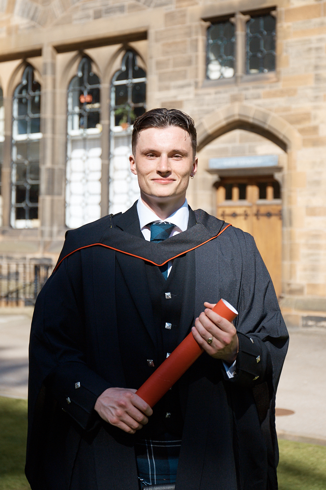

  

# About Me
My name is Jacob Leiser, I'm a recent Masters graduate with a strong foundation in quantitative data collection and analysis and am now pursuing a career in data science. This website gives some background information about me, highlights the main projects I have worked and shows examples of code I have used for these projects. I have always worked in R and am confident in a number of processes in this language: data manipulation, wrangling, analysis and visualisation. I have experience of git and version control (used to make this website), limited experience of Matlab and Python but am hoping to learn the latter online in the near future. I have also been taking online Machine Learning courses to further extend my skill base.

# Education
I recently graduated with a Distinction in the 'Research Methods of Psychological Science' MSc course from the University of Glasgow. I graduated with a 2:1 in 'Psychology' from the same university in 2018. Both the undergraduate and masters courses were quantitatively-focussed and I developed my coding skills through specific classes such as 'Statistics', 'Advanced Statistics' and 'Data Skills for Reproducible Science'. 
The dissertation I wrote for both courses were analysed by myself using R. You can read all about my Masters dissertation and see the code I used to analyse the various types of data I collected [here](eyetrack.html) and click [here](sleep.html) to find out more about my undergraduate dissertation.

# Work Experience
Since May 2017, I have worked at the Priory Hospital in Glasgow. This is a mental health facility which cares for three main clinical groups: general psychiatry (primarily anxiety and depression), addictions and eating disorders. My role as a Healthcare Assistant involves general clinical duties like observations as well as more specific tasks such as drug-testing and nasogastric feed restraint. 

From May 2017-2019 I was a Research Assistant for a Priory/NHS collaborative study investigating potential mediators of the relationship between childhood trauma and alcohol misuse in later life. You can read more about this project and my role in it [here](priory.html). 

# Interests
I am a keen fan of football, music and film. I would love to get the chance to combine my interests and work in data science in the world of football. I speak about plans for future projects [here](interests.html)
